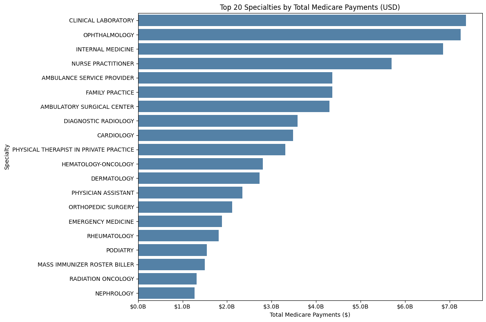
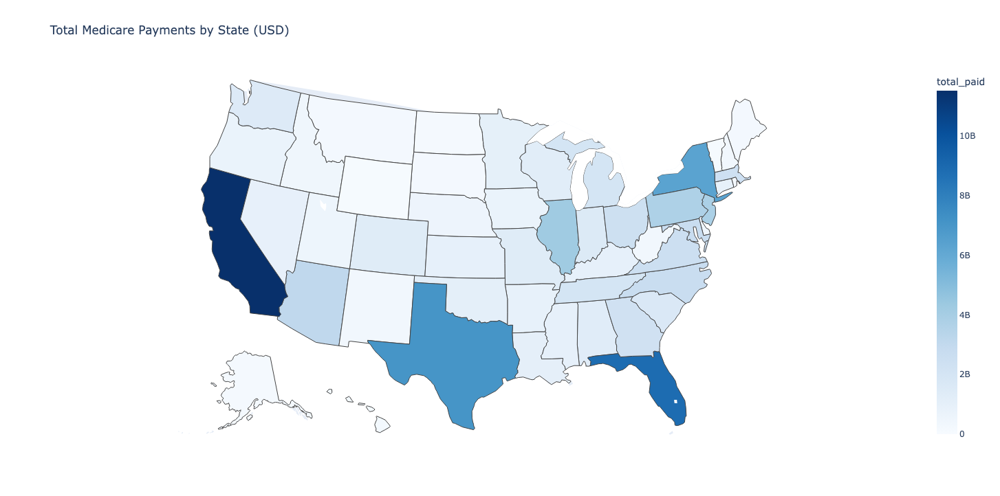

# Medicare Provider Payments and Service Utilization Analysis

## Overview and Problem Statement

Healthcare spending in the U.S. continues to rise, and understanding how Medicare funds are allocated is critical for policymakers, providers, and patients. This project explores Medicare utilization and payment data to identify trends in provider practices, service utilization, and payment distributions.

**Goal:**

- Identify providers, specialties, and regions driving the largest share of Medicare payments.
- Examine variations in utilization and reimbursement patterns across locations and services.
- Provide actionable insights that could inform healthcare policy, hospital decision-making, or patient education.

## Data Source

- **Dataset:** [Medicare Physician & Other Practitioners - by Provider and Service (2023)](https://data.cms.gov/provider-summary-by-type-of-service/medicare-physician-other-practitioners/medicare-physician-other-practitioners-by-provider-and-service) from Data.CMS.gov  
- **Key Fields:** Provider demographics (NPI, name, location, type), HCPCS codes, number of beneficiaries and services, submitted charges, Medicare allowed amounts, and actual payments.
- **Format:** CSV file (~3 GB, ~9.6M rows).

### Dataset Overview (Aggregate Metrics)

| Metric | Value |
|--------|-------|
| Total Providers | 1,175,281 |
| Total Beneficiaries | 824,740,808 |
| Total Services | 2,645,585,357 |
| Total Submitted Charges ($) | $371,191,432,499.21 |
| Total Medicare Allowed ($) | $118,466,072,108.77 |
| Total Medicare Payments ($) | $93,721,023,261.09 |
| Avg Submitted per Service ($) | $140.31 |
| Avg Medicare Payment per Service ($) | $35.43 |
| Avg Reimbursement Ratio | 25.2% |

## Methodology and Tools

**Tools & Libraries:**

- Python, Pandas, NumPy for data manipulation
- Tableau, Matplotlib, Seaborn, Plotly for visualizations
- Jupyter Notebook for exploratory analysis

**Process:**

1. **Data Cleaning**
   - Standardized categorical values (provider type, specialty, location)
   - Converted data types to appropriate formats
   - Dropped unused columns

2. **Feature Engineering & Aggregations**
   - Derived per-row totals: submitted charges, allowed amounts, and Medicare payments
   - Calculated per-beneficiary metrics: paid per beneficiary, submitted per beneficiary, services per beneficiary, reimbursement ratio
   - Aggregated data by specialty and state:
     - Counted unique providers
     - Summed total beneficiaries, services, and payments
     - Calculated services-weighted mean payments and charges
     - Computed weighted reimbursement ratios (total paid / total submitted)

3. **Exploratory Data Analysis (EDA)**
   - Summary statistics for payments, charges, and service counts
   - Distribution analysis of provider specialties and regions
   - Correlation analysis between submitted charges, allowed amounts, and Medicare payments
   - Outlier detection for unusually high billing relative to payments
   - **Weighted means were consistently used throughout to avoid distortion from outliers and differences in provider volume.**

4. **Visualizations**
   - [Tableau Dashboard](https://public.tableau.com/app/profile/lance/viz/MedicareProviderPaymentsandServiceUtilizationAnalysis/MedicareOverviewNavigation)
   - Bar chart of total Medicare payments by specialty
   - Boxplot of weighted reimbursement ratio distributions by specialty
   - Heatmaps and choropleth maps showing geographic distribution of Medicare payments
   - Scatter plots of submitted charges vs. Medicare payments, with parity line and annotations for high reimbursement ratios

## Key Visualizations
### [Tableau Dashboard](https://public.tableau.com/app/profile/lance/viz/)

### Top 20 Specialties Receiving Medicare Payments


Bar chart showing the top 20 specialties by total Medicare payments, highlighting which specialties receive the highest reimbursements.

### Medicare Payments by State

Choropleth map showing total Medicare payments by state.


## Key Performance Indicators (KPIs)

### Top States with the Highest Medicare Payments

| State | Providers | Beneficiaries | Services | Total Submitted ($) | Total Allowed ($) | Total Paid ($) | Weighted Reimbursement Ratio |
|-------|-----------|---------------|---------|------------------|-----------------|----------------|-----------------------------|
| CA | 93,498 | 81,471,758 | 268,124,028 | $44,266,088,289 | $14,353,749,148 | $11,525,455,735 | 26.0% |
| FL | 77,006 | 74,329,690 | 286,685,720 | $33,327,507,269 | $11,195,639,950 | $8,883,415,882 | 26.7% |
| TX | 78,270 | 61,977,305 | 217,132,609 | $30,166,113,072 | $8,859,429,037 | $7,074,719,346 | 23.5% |
| NY | 80,484 | 51,846,911 | 163,319,527 | $27,327,541,950 | $8,054,829,184 | $6,347,958,091 | 23.2% |
| IL | 47,277 | 36,917,045 | 145,639,632 | $16,609,666,882 | $5,249,696,740 | $4,262,580,511 | 25.7% |
| NJ | 36,541 | 41,878,323 | 117,720,150 | $16,889,906,512 | $4,801,460,978 | $3,851,850,194 | 22.8% |
| PA | 58,065 | 31,661,062 | 110,690,727 | $13,480,901,837 | $4,782,477,115 | $3,755,630,338 | 27.9% |
| AZ | 24,018 | 21,367,252 | 73,561,702 | $10,605,533,878 | $3,901,242,719 | $3,106,083,686 | 29.3% |
| MD | 24,406 | 20,824,677 | 72,945,079 | $9,751,372,521 | $3,457,920,708 | $2,706,273,168 | 27.8% |
| NC | 40,231 | 35,643,279 | 86,899,821 | $10,891,802,831 | $3,389,695,857 | $2,692,010,853 | 24.7% |

### Top Specialties Receiving Medicare Payments

| Specialty | Providers | Beneficiaries | Services | Total Submitted ($) | Total Allowed ($) | Total Paid ($) | Weighted Reimbursement Ratio |
|-----------|-----------|---------------|---------|------------------|-----------------|----------------|-----------------------------|
| CLINICAL LABORATORY | 3,103 | 159,021,893 | 380,483,306 | $24,039,344,462 | $7,492,735,790 | $7,365,996,708 | 30.6% |
| OPHTHALMOLOGY | 17,001 | 28,529,511 | 89,621,393 | $23,124,971,715 | $9,467,217,124 | $7,246,047,696 | 31.3% |
| INTERNAL MEDICINE | 88,703 | 60,814,096 | 136,564,720 | $21,319,918,129 | $8,828,637,670 | $6,856,443,874 | 32.2% |
| NURSE PRACTITIONER | 174,681 | 46,739,912 | 127,123,084 | $18,599,474,765 | $7,433,308,551 | $5,693,318,948 | 30.6% |
| AMBULANCE SERVICE PROVIDER | 9,332 | 12,170,285 | 115,953,225 | $19,888,038,268 | $5,521,702,109 | $4,367,981,204 | 22.0% |
| FAMILY PRACTICE | 78,514 | 48,395,779 | 93,311,228 | $12,825,219,341 | $5,721,359,917 | $4,361,954,965 | 34.0% |
| AMBULATORY SURGICAL CENTER | 5,353 | 4,612,580 | 19,482,340 | $26,549,197,621 | $5,371,189,302 | $4,298,258,792 | 16.2% |
| DIAGNOSTIC RADIOLOGY | 31,554 | 77,223,917 | 198,383,952 | $22,728,576,435 | $4,519,110,909 | $3,588,173,382 | 15.8% |
| CARDIOLOGY | 19,399 | 36,759,993 | 57,772,858 | $13,624,668,050 | $4,598,427,404 | $3,485,495,445 | 25.6% |
| PHYSICAL THERAPIST IN PRIVATE PRACTICE | 73,457 | 19,054,795 | 161,789,617 | $11,143,576,023 | $4,291,927,857 | $3,310,403,894 | 29.7% |

### Specialties with Weighted Reimbursement Ratio >= 60%

| Specialty | Providers | Beneficiaries | Services | Total Submitted ($) | Total Allowed ($) | Total Paid ($) | Weighted Reimbursement Ratio |
|-----------|-----------|---------------|---------|------------------|-----------------|----------------|-----------------------------|
| PUBLIC HEALTH OR WELFARE AGENCY | 210 | 116,452 | 119,764 | $7,900,107 | $7,184,872 | $7,177,088 | 90.8% |
| MASS IMMUNIZER ROSTER BILLER | 28,317 | 20,781,108 | 37,601,842 | $1,666,168,805 | $1,495,742,080 | $1,495,736,655 | 89.8% |
| CENTRALIZED FLU | 9,351 | 12,884,368 | 22,494,169 | $1,065,544,982 | $926,319,973 | $926,319,973 | 86.9% |
| OPIOID TREATMENT PROGRAM | 842 | 64,099 | 1,256,817 | $258,986,954 | $219,296,853 | $215,144,577 | 83.1% |
| MEDICARE DIABETES PREVENTIVE PROGRAM | 28 | 1,780 | 1,780 | $232,078 | $178,535 | $178,535 | 76.9% |
| PHARMACY | 2,960 | 3,016,116 | 48,087,840 | $630,087,532 | $457,738,849 | $432,029,536 | 68.6% |

## 📊 Key Findings and Insights

### Top Specialties Driving Medicare Spending
- **Clinical Laboratory** leads in total paid, with **$7.37B**, covering **159M beneficiaries** across **380M services**, with a reimbursement ratio of **31%**.
- **Ophthalmology** and **Internal Medicine** are also high-payment specialties, receiving **$7.25B** and **$6.86B**, respectively, with reimbursement ratios around **31–32%**.
- **Ambulatory Surgical Centers** have the **highest submitted charges ($26.5B)** but a **low reimbursement ratio (16%)**, highlighting high billed amounts versus paid.
- **Specialties with weighted reimbursement ratio ≥ 60%** (e.g., Public Health or Welfare Agency, Mass Immunizer Roster Biller) account for **6 out of 104 specialties (~6%)**, highlighting a small subset with unusually high efficiency or payment-to-charge ratios compared to the rest.

👉 Overall, **procedural and high-volume specialties** drive the majority of Medicare payments, but **high reimbursement efficiency is rare**, concentrated in a small subset of specialties.

### Geographic Distribution of Payments
- **California** received the **highest total Medicare payments ($11.5B)**, covering **268M services**, followed by **Florida ($8.88B)**, **Texas ($7.07B)**, and **New York ($6.35B)**.
- Weighted reimbursement ratios across top states are fairly consistent (**22–29%**), suggesting **similar payment efficiency nationally** despite differences in total spend.
- Smaller states like **Arizona (29%)** and **Pennsylvania (27.9%)** demonstrate slightly higher reimbursement efficiency relative to larger states like Texas (23.5%).

👉 Medicare spending is **concentrated in a few large states**, but **efficiency (paid/submitted) is relatively stable** across states.

## 🏁 Conclusion

This analysis of the **2023 Medicare Provider Utilization and Payment Data** reveals that:  

1. **High-volume specialties** (Clinical Laboratory, Internal Medicine, Ophthalmology) and **procedural specialties** (Ambulatory Surgical Centers) dominate total Medicare payments.
2. **Extremely high reimbursement ratios** are uncommon, occurring in a **small subset of specialties (6%)**, including public health and preventive programs.
3. **State-level payments** are dominated by **CA, FL, TX, and NY**, but reimbursement efficiency is similar across top states (~22–29%).
4. These findings show **concentration of Medicare resources** in specific specialties and states, with **a few exceptions achieving high payment efficiency**, providing insights for **policy evaluation, resource allocation, and cost monitoring**.

### Limitations & Considerations
- Dataset includes only **Medicare fee-for-service claims**, not Medicare Advantage or private insurers.
- Only **2023 data** was analyzed; trends over time or seasonal patterns are not captured.
- Payments reflect **Medicare reimbursements, not provider costs**.
- **Weighted reimbursement ratios** highlight efficiency, but extreme values may still be influenced by **small-volume providers or reporting artifacts**.
- Analysis focused on **state- and specialty-level aggregations**; provider-level patterns, especially for extremely high- or low-reimbursement ratios, may require deeper study.

### Future Work
- Expand the dataset to **multiple years** to analyze temporal trends, seasonal patterns, and changes in reimbursement efficiency.
- Develop **predictive models of provider payments or utilization**, including weighted reimbursement ratio forecasts.
- Link payment/utilization data with **patient demographics or health outcomes** to assess policy impacts.
- Benchmark specialties against **national averages** to identify inefficiencies or outliers.
- Drill down into **procedure- and provider-level networks**, especially for specialties with **extremely high reimbursement ratios**, to reveal concentration or unusual billing patterns.
- Explore **anomaly detection models** for unusually high reimbursement ratios or discrepancies between submitted and paid amounts.

## Repository Structure

```
├── data/
│   ├── images/          # Any dataset-related images or diagrams
│   ├── input/           # Raw datasets
│   └── output/          # Cleaned or processed datasets (e.g., CSVs from notebook)
├── notebooks/           # Jupyter notebooks for cleaning and EDA
├── README.md            # Project documentation
```
